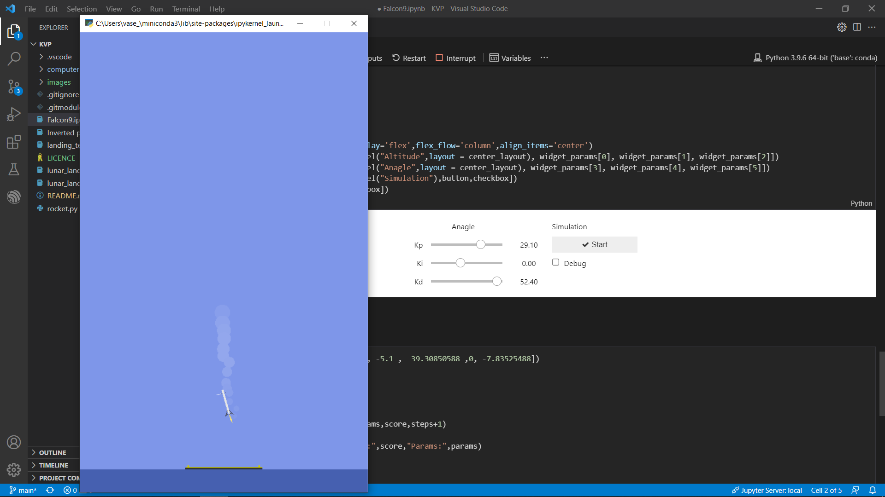
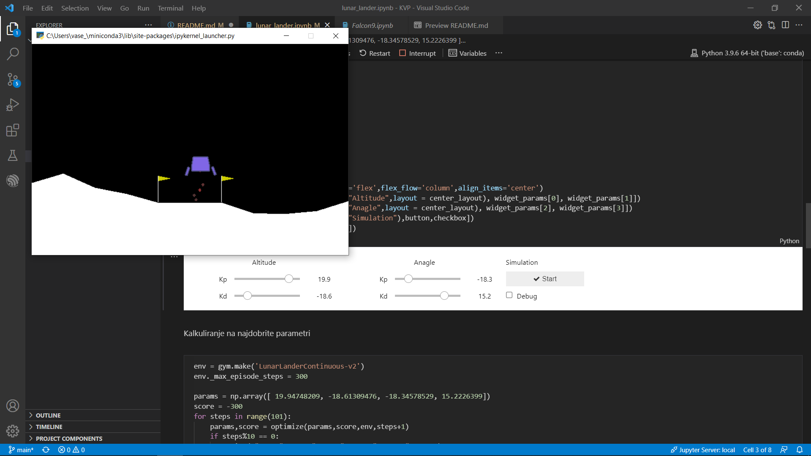
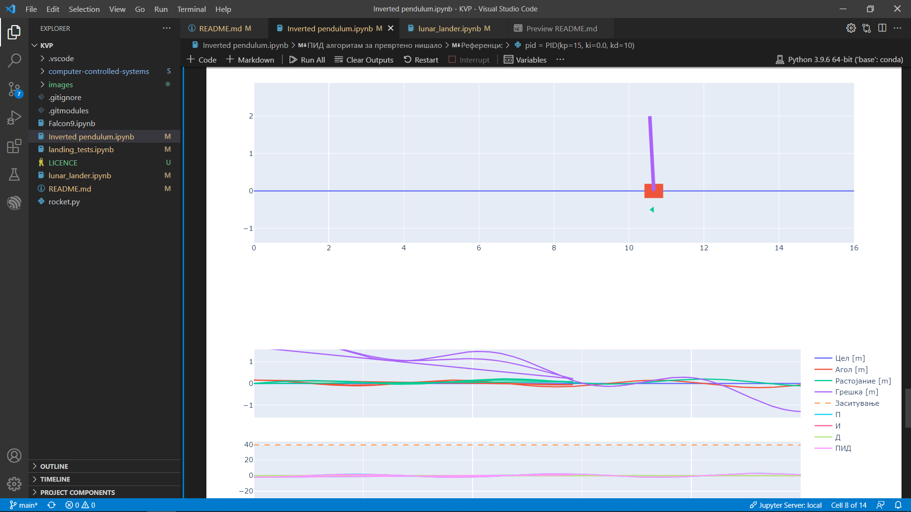

<!-- PROJECT LOGO -->
 

  

  <h3 align="center">Computer Process Control</h3>

  

    Faculty of Electrical Engineering and Information Technologies
  

<!-- ABOUT THE PROJECT -->
## About The Project

Computer implemented algorithms for process control, whether the computer is a microprocessor, microcontroller, PC, or an industrial computer. It also utilizes the previous knowledge of control theory by implementing the known and taught control algorithms using computers, thus coping with both the hardware and software issues of the process. All the lectures and homeworks are in the submodule [computer-controlled-systems](https://gitlab.com/feeit-freecourseware/computer-controlled-systems).

### My projects

* [Falcon9](https://github.com/vasetrendafilov/KVP/blob/main/Falcon9.ipynb) using pid algo for the assent and landing on the platform.

* [LunarLander](https://github.com/vasetrendafilov/KVP/blob/main/lunar_lander.ipynb) using pid and heuristics to land on the platform.

* [InvertedPendulum](https://github.com/vasetrendafilov/KVP/blob/main/Inverted%20pendulum.ipynb) using pid to control position of the pendulum and the cart on the plane.

### Built With

* [JupyterLab](https://jupyter.org/)
* [Numpy](https://numpy.org/)
* [Sympy](https://www.sympy.org/en/index.html)
* [Plotly](https://plotly.com/)
* [OpenAiGym](http://gym.openai.com/) 

<!-- LICENSE -->
## License

Distributed under the MIT License. See `LICENSE` for more information.

<!-- CONTACT -->
## Contact

Vase Trendafilov - [@TrendafilovVase](https://twitter.com/TrendafilovVase) - vasetrendafilov@gmail.com

Project Link: [https://github.com/vasetrendafilov/KVP](https://github.com/vasetrendafilov/KVP)
